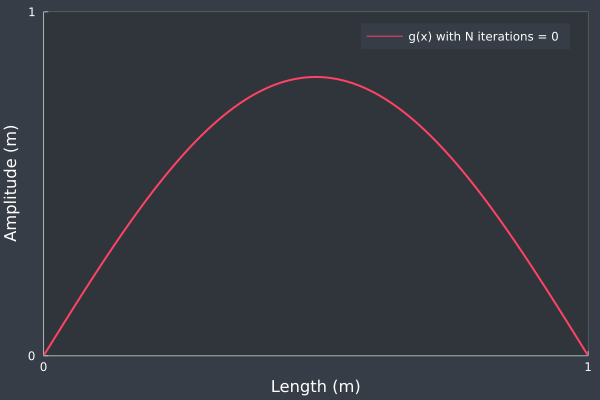
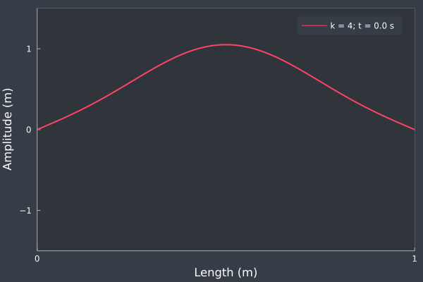

# Damped string simulation

This is a standing wave simulation as a damp string project written in Julia.

## Oscillation of a stretched string

A stretched string oscillation is described by the partial differential equation (PDE):

%7D%7B%5Cpartial%20t%5E2%7D%20=%20v%5E2%20%5Cfrac%7B%5Cpartial%5E2%20y(x,t)%7D%7B%5Cpartial%20x%5E2%7D%20-%20k%20%5Cfrac%7B%5Cpartial%20y(x,t)%7D%7B%5Cpartial%20t%7D)

Where `y(x,t)` represents the y-axis position of a given x coordinate in the string, `v` the velocity of the string and `k` the dampening of the string.

Both string extremities are fixed with the initial conditions as:

%20=%20f(x)%5C%5C%5Cfrac%7B%5Cpartial%20y(x,0)%7D%7B%5Cpartial%20t%7D%20=%20g(x)%5Cend%7Bcases%7D)

For demonstration purposes, the following will be used:

%5C%5Cv%20=%201~(ms%5E%7B-1%7D)%5C%5Cg(x)%20=%20%5Csum_%7Bn%7D%5E%7BN%7D%20b_n%20%5Csin(%5Cfrac%7B(2n%20&plus;%201)x%5Cpi%7D%7BL%7D)%5Cend%7Bcases%7D)

where `L` represents the length of the string and, as an integer, will act as the harmonic number, `g(x) = f(x)`, `N` the maximum number of iterations, and `b_n` the Fourier coefficient defined as:

%5En%7D%7B(2n%20&plus;%201)%5E2%7D)

The following animation displays the effect of the number of iterations `N` over the function `g(x)` where `t = 0`.

Adding the time component, the amplitude function is defined as:

%20=%20g_n(x)%20d_n(t))

where

%7D%7B%5Cpartial%20t%5E2%7D%20=%20v%5E2%20%5Cfrac%7B%5Cpartial%5E2%20Y_n(x,t)%7D%7B%5Cpartial%20x%5E2%7D%20-%20k%20%5Cfrac%7B%5Cpartial%20Y_n(x,t)%7D%7B%5Cpartial%20t%7D)

is solved for `d_n(t)` taking into account the initial conditions.

Finally, for heavy damping (`k = 4`), the resulting string oscillation is as follows:

